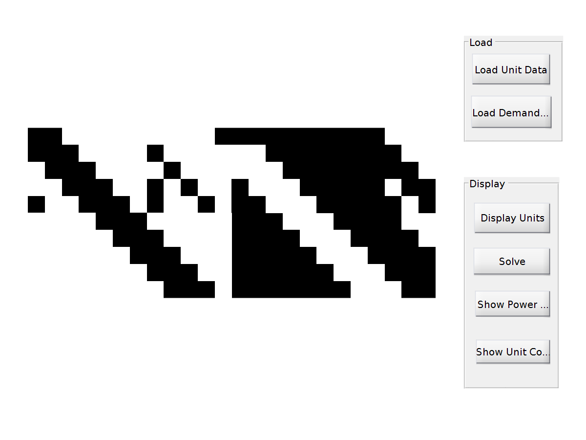

# MILP-UC
The unit commitment problem (UC) in electrical power production is a large family of mathematical optimization problems where the production of a set of electrical generators is coordinated in order to achieve some common target, usually either match the energy demand at minimum cost or maximize revenues from energy production. This is necessary because it is difficult to store electrical energy on a scale comparable with normal consumption; hence, each (substantial) variation in the consumption must be matched by a corresponding variation of the production.
This optimization project is on the unit commitment problem and its MILP solution, with linearized constraints/objective.


## Usage

Run the project using the MATLAB GUI file `UC_gui.m`. Data should be fed in the form of CSVs with CSV represented with the following fields:

Pmax | Pmin | a | b | c | min up | min down | hot start cost | cold start cost | coldstart hrs | init stat
 --- | --- | --- | --- | --- | --- | --- | --- | --- | --- | --- 
Unit 1 | | | | | | | | | | 
Unit 2 | | | | | | | | | | 
... | | | | | | | | | | 

Demand should be provided in the format below

Demand | 254 | 23 | 425 | 323 | ...

Note that the above would represent demand at specific time period.
Time | 1 | 2 | 3 | 4 | ... 


Start with loading Demand and Unit data, using the two buttons. Then press the Display Units button and check the output in MATLAB. Implies that the program isn't stuck on a particular step.

Then tap the Solve button and the Display Units button. Might take a while for "oui" to show up, since solving the problem takes time.

Once it is solved, clicking "Show Power Graph" will output different graphs for the unit powers, solved with `inlinprog`. Clicking Show Unit Commitment will output a 0, 1 unit commitment image.

## Results

For the u10 data obtained from [1], the results obtained are given below:


```
LP:                Optimal objective value is 525756.124482.                                        

Cut Generation:    Applied 10 Gomory cuts,                                                          
                   36 implication cuts, 29 clique cuts,                                             
                   55 cover cuts, 67 mir cuts,                                                      
                   and 8 flow cover cuts.                                                           
                   Lower bound is 530610.052748.                                                    

Heuristics:        Found 4 solutions using rounding.                                                
                   Upper bound is 532181.627590.                                                    
                   Relative gap is 0.30%.                                                          

Cut Generation:    Applied 12 implication cuts,                                                     
                   1 clique cut, 11 Gomory cuts,                                                    
                   and 2 flow cover cuts.                                                           
                   Lower bound is 530726.069689.                                                    
                   Relative gap is 0.27%.                                                          

Branch and Bound:

   nodes explored | total time (s) | num int solution | integer  fval | relative gap (%)
   --- | --- | --- | --- | ---                                          
   224 | 22.67 | 6 | 5.321532e+05 | 0.000000e+00                                          

Optimal solution found.

Intlinprog stopped because the objective value is within a gap tolerance of the optimal value, options.AbsoluteGapTolerance = 0 (the default value). The intcon variables are
integer within tolerance, options.IntegerTolerance = 1e-05 (the default value).
```

Thus we solved the problem solved by the Genetic Algorithm in 221 seconds with optimal objective value 565825, however, we got 532153.2 value in just 22.67 seconds, a 6% improvement with 10x speedup! The outputs are given below:





[1]: S. A. Kazarlis, A. G. Bakirtzis and V. Petridis, "A genetic algorithm solution to the unit commitment problem," in IEEE Transactions on Power Systems, vol. 11, no. 1, pp. 83-92, Feb. 1996, doi: 10.1109/59.485989.


## Some Troubleshooting
```
ERROR - (intlinprog): problem must contain at least "f", "intcon", A" and "b".
Output argument "x" (and maybe others) not assigned during call to "intlinprog".
```
For the error type above, ensure that you don't have an external 'intlinprog' library installed. Popular examples are ***mosek*** and ***yalmip***.


